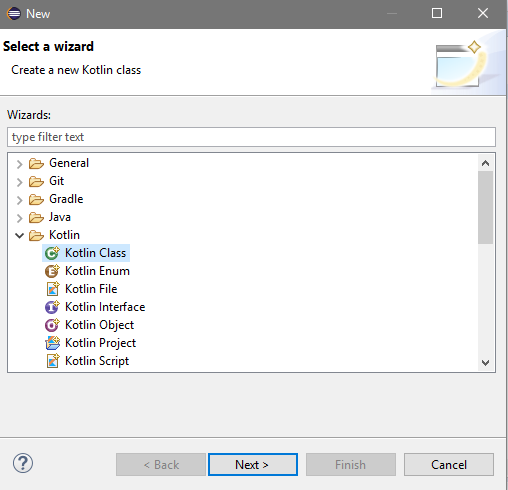

# Aprende un lenguaje de programación en un día (ejercicio voluntario para subir nota).

## Introducción

Cuando te sacaste el carnet de conducir, aprendiste las normas de circulación así como los fundamentos básicos para manejar un coche: volante, marchas, freno, acelerador, embrague, retrovisores... Seguramente, el coche que conduces ahora es diferente al que utilizaste para aprender a conducir, no obstante, lo puedes llevar sin problema. Cada coche tiene sus peculiaridades, pero quien sabe manejar un automóvil, puede adaptarse a las medidas, tacto y comportamiento de un vehículo en cuestión de horas.

Aprender a programar es como aprender a conducir. Si tienes una base sólida de programación y sabes manejar con soltura los tipos de datos, bucles, arrays, clases, métodos, etc. podrás pasar de un lenguaje a otro en un período relativamente corto, simplemente tendrás que adaptarte a la sintaxis y a las peculiaridades del nuevo lenguaje.

Con este ejercicio se pretende despertar el interés por otros lenguajes de programación distintos al que el alumno está estudiando como primer lenguaje.

Sigue los pasos que se indican a continuación.

## Creación del equipo

Este ejercicio se debe hacer en grupos de 3 alumnos. Uno de ellos será el representante del grupo.

## Forkea forkea

El representante del grupo debe hacer un *fork* de este repositorio para utilizarlo como base.

## Añadiendo colaboradores

El encargado del grupo deberá añadir como colaboradores del repositorio *forkeado* a los otros dos miembros, para trabajar todos sobre los mismos archivos. Cuando alguien es colaborador en un repositorio, puede hacer *push* a él sin necesidad de pedir permiso o hacer *pull request*.

Para añadir colaboradores hay que hacer click en la pestaña *Settings* y seleccionar luego *Collaborators* en el menú.

## Miembros del grupo

* Jose Daniel Jiménez Quintana
* Jose María Gómez Martín
* Ernesto Velasco Soler

## Lenguaje de programación

El profesor llevará una cajita llena de papelitos con los nombres de distintos lenguajes de programación. Los encargados de cada grupo meterán la mano en la caja y sacarán dos papelitos, de los cuales el grupo elegirá uno. Se permite hacer intercambio de papelitos entre grupos.

Escribe el lenguaje de programación elegido por el grupo.

* Kotlin

Los papelitos se han recortado de este [documento](lenguajes_de_programacion.pdf).

## Información sobre el lenguaje

Kotlin es un lenguaje de programación para aplicaciones multiplataforma que es 100% interoperable con Java y Android y que se ejecuta en la JVM, también se puede transpilar a javaScript para hacer aplicaciones para navegadores, además Google lo ha hecho oficial para Android.
La idea con la que se creo este lenguaje es que fuese claro, conciso y fácil de leer y escribir.
[Fuente - Programando o Intentándolo](https://programandoointentandolo.com/2017/10/hola-mundo-kotlin.html).

## Herramientas de desarrollo

El software elegido para programar en Kotlin ha sido Eclipse y puedes descargarlo pinchando [aquí](https://www.eclipse.org/downloads/)
Una vez instalado Eclipse, pinchamos en Help y luego en Eclipse Marketplace y buscamos Kotlin.

Una vez instalado crearemos un proyecto Kotlin y un archivo para comenzar a programar.



## Poniendo en práctica el lenguaje

Pon en práctica el lenguaje de programación realizando los siguientes ejercicios. Para cada uno de los ejercicios, pega el código fuente de la solución y una captura de pantalla.

### 1. ¡Hola mundo!

Realiza un programa que muestre por pantalla la frase **¡Hola mundo!**.
```kotlin
fun main(args : Array<String>) {
    println("Hello, World!")
}
```

### 2. Pirámide

Dada una altura introducida por el usuario, realiza un programa que pinte una pirámide a base de asteriscos con la altura indicada.

Pirámide rellena:
```kotlin
fun main(args : Array<String>) {
	print("Introduce la altura de la pirámide: ")
	var altura = readLine()!!.toInt()
	var nivel = 1
	var longitud = 1
	var espacios = altura - 1
	while (nivel <= altura) {
		for (i in 1..espacios) {
			print(" ")
		}
		for (i in 1..longitud) {
			print("*")
		}
		println()
		nivel++
		espacios--
		longitud += 2
	}
}
```
Pirámide hueca:
```kotlin
fun main(args: Array<String>) {
	println("Introduzca la altura de la pirámide: ")
	var alturaIntroducida = readLine()!!.toInt()
	var espaciosPorDelante = alturaIntroducida-1
	var espaciosInternos = 0
	var altura = 1
	var relleno : String = "*"
	while (altura<alturaIntroducida){
		for (num in  0..espaciosPorDelante){
			print(" ")
		}
		print(relleno)
		for(num in 1..espaciosInternos){
			print(" ")
		}
		if(altura>1){
			print(relleno)
		}
		println()
		altura++
		espaciosPorDelante--
		espaciosInternos+=2
		}
		print(" ")
		for(num in 1..altura*2){
		print(relleno)
		}
	}
```
### 3. Arrays y números aleatorios

Realiza un programa que rellene un array (o una estructura similar) con 20 números enteros aleatorios entre 1 y 100 y que seguidamente los muestre por pantalla. A continuación, se deben pasar los números primos a las primeras posiciones del array y los no primos a las posiciones restantes. Muestra finalmente el array resultado.

## Presentación de resultados

Cada equipo explicará al resto de la clase lo aprendido durante la realización del ejercicio. Todos los miembros de cada equipo deben participar en la explicación. Se puede utilizar como material de base para la presentación el repositorio de GitHub.

## Recompensa

* Todos los alumnos que realicen correctamente la actividad tendrán 0'25 puntos extra en la nota del trimestre.

* Los miembros del equipo más votado ganarán un premio.

:star: Si te ha gustado este ejercicio, dale una estrellita al [repositorio original](https://github.com/LuisJoseSanchez/aprende-un-lenguaje-en-un-dia).

